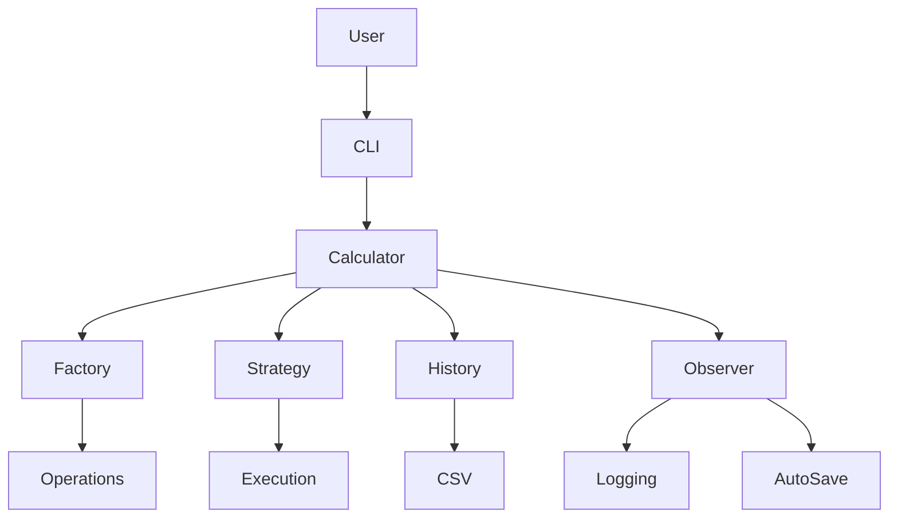

# History Calculator

A modular, production-style command-line calculator application built in Python using advanced object-oriented design patterns, persistent history storage with pandas, environment-based configuration, and automated testing with continuous integration.

---

## Badges


## Overview

This project implements a modular command-line calculator using clean architecture principles and multiple design patterns.

It supports:

- A fully interactive REPL (Read–Eval–Print Loop)
- Arithmetic operations including power, root, modulus, integer division, percentage, and absolute difference
- Persistent calculation history stored as CSV using pandas
- Timestamped history entries (stored in CSV but hidden from CLI history view)
- Undo and redo functionality via state snapshots
- Environment-based configuration using dotenv
- Observer-driven logging and optional auto-save behavior
- Strategy-based execution abstraction
- Factory pattern for operation creation
- Colorized CLI output for improved readability
- ≥90% unit test coverage with pytest
- Automated testing using GitHub Actions

The project emphasizes separation of concerns, maintainability, extensibility, and professional development practices.

---

## REPL Interface

The application runs as a continuous command-line session allowing users to:

- Perform calculations
- View calculation history
- Clear history
- Undo and redo actions
- Save and load history from CSV
- Request help
- Exit cleanly

Colorized output improves readability:

- **Green** → calculation results  
- **Red** → errors  
- **Yellow** → help output  
- **Cyan** → history output  

---

## Supported Commands

### Arithmetic Operations

Each operation accepts **two numeric arguments**.

- `add a b` — Adds two numbers
- `sub a b` — Subtracts two numbers
- `mul a b` — Multiplies two numbers
- `div a b` — Divides two numbers
- `pow a b` — Raises `a` to the power of `b`
- `root a b` — Computes the `b`-th root of `a`
- `mod a b` — Computes the modulus (remainder) of `a` divided by `b`
- `int_div a b` — Performs integer division of `a` by `b`
- `percent a b` — Computes `(a / 100) * b`
- `abs_diff a b` — Computes the absolute difference between `a` and `b`

### History and State Management

- `history` — Displays calculation history
- `clear` — Clears history
- `undo` — Reverts the last change
- `redo` — Reapplies the last undone change
- `save` — Saves history to CSV
- `load` — Loads history from CSV
- `help` — Displays instructions
- `exit` — Exits the program

---

## Architecture and Design Patterns

This project implements several advanced object-oriented design patterns.

## System Architecture

The calculator is organized around a central `Calculator` facade that coordinates operations, history management, observers, and execution strategies.



### Facade Pattern

The `Calculator` class acts as the central interface for executing operations, managing history, observers, and persistence.

---

### Factory Pattern

`CalculationFactory` dynamically instantiates operation objects based on user input, eliminating conditional logic inside the REPL.

---

### Strategy Pattern

Execution behavior is abstracted through interchangeable strategies.

The default strategy performs direct calculation execution, but additional strategies could alter execution logic without modifying the core system.

---

### Observer Pattern

Observers respond to calculator state changes.

Two observers are implemented:

- **LoggingObserver**  
  Logs each calculation to a log file with operation details.

- **AutoSaveObserver**  
  Automatically saves history to CSV when calculations occur or history changes.

---

### Memento Pattern

Undo and redo functionality is implemented using history snapshots stored in caretaker stacks.

This allows the application to safely restore previous states without mutating the existing history structure.

---

## Configuration

The application uses environment variables via `python-dotenv`.

Create a `.env` file in the project root.

### Environment Variables

Base directories:

- `CALCULATOR_LOG_DIR` — Directory where log files are stored
- `CALCULATOR_HISTORY_DIR` — Directory where history CSV files are stored

History settings:

- `CALCULATOR_MAX_HISTORY_SIZE` — Maximum number of stored history entries
- `CALCULATOR_AUTO_SAVE` — Automatically save history after state changes

Calculation settings:

- `CALCULATOR_PRECISION` — Decimal precision for results
- `CALCULATOR_MAX_INPUT_VALUE` — Maximum allowed numeric input
- `CALCULATOR_DEFAULT_ENCODING` — Default encoding for file operations

Example `.env` file:

```
CALCULATOR_HISTORY_DIR=.
CALCULATOR_LOG_DIR=.

CALCULATOR_AUTO_SAVE=false
CALCULATOR_PRECISION=6
CALCULATOR_MAX_HISTORY_SIZE=1000
CALCULATOR_DEFAULT_ENCODING=utf-8
```

Configuration errors are handled gracefully during application startup.

---

## Persistent History

The `CalculationHistory` class:

- Stores history using a pandas DataFrame
- Serializes history to CSV files
- Loads history from CSV
- Automatically adds a **timestamp column** in UTC ISO format
- Validates CSV structure
- Supports snapshot and restore operations for undo/redo

The timestamp column is stored in the CSV but **not displayed in CLI history output**.

---

## Logging

Logging is implemented using Python’s built-in `logging` module.

The system logs:

- Calculations performed
- Operation details (operation, operands, result)
- Important events such as loading history or failures

Example log entry:

```
2026-03-03 18:45:02 INFO calc op=add a=2.0 b=3.0 result=5.0
```

Logs are written to the file defined by the configuration.

---

## Error Handling Strategy

This application demonstrates multiple error handling paradigms.

### LBYL (Look Before You Leap)

Used for validating input ranges and ensuring required files exist before loading.

### EAFP (Easier to Ask Forgiveness than Permission)

Used when parsing user input and converting types.

Custom exceptions include:

- `ValidationError`
- `ConfigurationError`
- operation-level exceptions

All invalid inputs are handled gracefully with clear user feedback.

---

## Testing

This project uses **pytest** with:

- Unit tests for all modules
- Parameterized tests
- Positive and negative case testing
- Observer behavior validation
- Strategy behavior validation
- Persistence and CSV serialization tests
- REPL logic testing via dependency injection

### Test Coverage

Test coverage is measured using **pytest-cov**.

Coverage requirement:

```
≥ 90%
```

---

### Run Tests Locally

From the `calculator-app` directory:

```
pytest --cov=app --cov-report=term-missing
```

---

## Continuous Integration

GitHub Actions automatically runs on every push to `main`.

The workflow:

1. Installs project dependencies
2. Runs pytest
3. Measures coverage
4. Fails if coverage drops below the threshold

Workflow configuration:

```
.github/workflows/python-app.yml
```

---

## Setup Instructions

### Clone the Repository

```
git clone <repository-url>
cd History_Calculator/calculator-app
```

---

### Create Virtual Environment

Mac/Linux:

```
python -m venv .venv
source .venv/bin/activate
```

Windows:

```
python -m venv .venv
.venv\Scripts\activate
```

---

### Install Dependencies

```
pip install -r requirements.txt
```

---

## Running the Calculator

Start the REPL:

```
python -m app.calculator_repl
```

---

### Example Usage

```
> add 2 3
Result: 5.0

> pow 2 3
Result: 8.0

> percent 25 200
Result: 50.0

> abs_diff 10 4
Result: 6.0

> history
add 2 3 = 5.0
pow 2 3 = 8.0

> undo
Undo successful.
```

---

## Project Structure

```
calculator-app/
│
├── app/
│   ├── calculator/
│   │   ├── cli.py
│   │   ├── facade.py
│   │   └── ...
│   ├── operation/
│   │   ├── arithmetic.py
│   │   └── base.py
│   ├── observers.py
│   ├── history.py
│   ├── calculator_config.py
│   └── exceptions.py
│
├── tests/
│   ├── test_cli.py
│   ├── test_operations.py
│   └── ...
│
├── requirements.txt
├── README.md
└── .github/workflows/python-app.yml
```

---

## Key Technologies

- Python
- pandas
- pytest
- pytest-cov
- python-dotenv
- colorama
- GitHub Actions